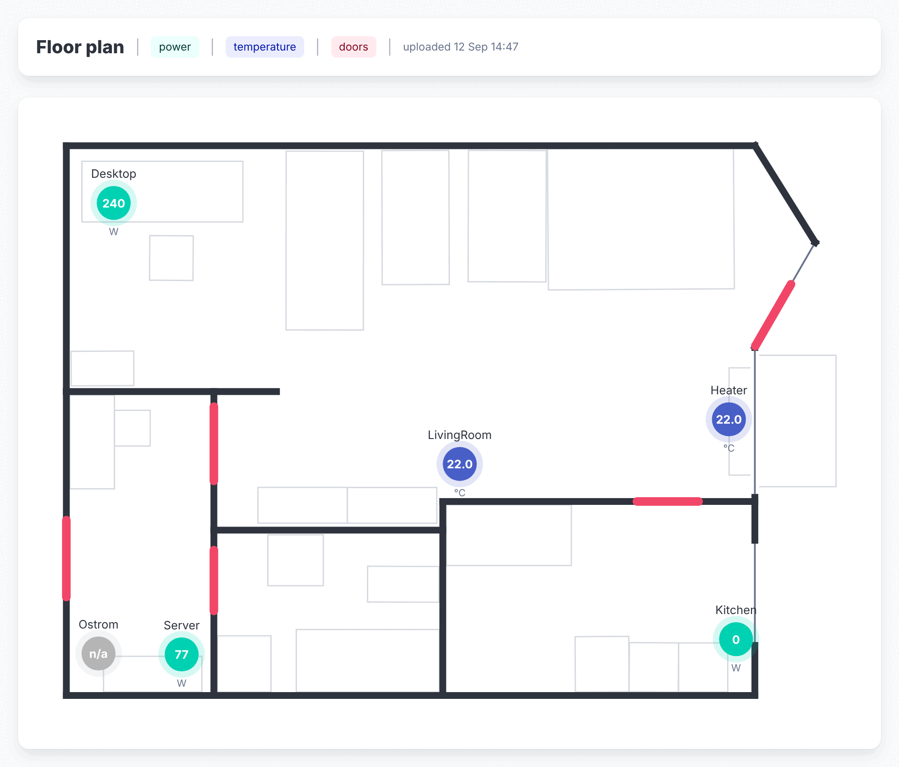

<p align="center">
  
</p>

<h1 align="center">armdash</h1>

<p align="center">
  <a href="https://github.com/xuedi/armdash/actions/workflows/ci.yml"></a>
  <a href="https://github.com/xuedi/armdash/releases"></a>
  <a href="LICENSE"></a>
  <a href="https://go.dev"></a>
  
</p>

<p align="center"><b>A tiny dashboard for your home server and your FRITZ!Box.</b><br>
One static binary, around 20 MB of memory, years of history in Prometheus -<br>
comfortable on a 12 W ARM board, just as happy on x86. Project page: <a href="https://armdash.org">armdash.org</a></p>

---

armdash shows your server's vitals and your FRITZ!Box smart home in one web page: what draws power
right now, which window is open, how warm each room is, and all of it charted back over the years.
Every reading goes into Prometheus and stays there; armdash reads it back to draw the pages.

<p align="center"></p>

## Why armdash

- **Small.** One static binary with the standard library only: no database, no node toolchain, no
  runtime dependencies. It idles at around 20 MB and under 0.1 % of one core on the Radxa Dragon
  Q6A it was written for, and runs on any Linux, FreeBSD or macOS.
- **Grafana without the Grafana.** Grafana is a large thing to run permanently on a 12 W box, is not
  packaged for aarch64 on Arch Linux ARM, and most of it goes unused for a handful of charts and a
  floor plan. armdash is the small version.
- **History that stays.** Every power, energy, temperature and humidity reading is kept for years
  at one-minute resolution, where the box itself keeps coarse summaries at best.
- **Set up in the browser.** The first visit creates the login; Prometheus, the FRITZ!Box and navbar
  links are entered on the settings page, applied without a restart, with a status box that says
  what is still missing.

## What it shows

- **Host.** CPU, memory, disks, temperatures, load and uptime from node_exporter, now and as charts
  from one hour to one year.
- **FritzHome.** Smart plugs, thermostats, sensors, door and window contacts and bulbs, read straight
  from the box, no exporter to run. A "now" overview (where the power goes, what is on or open, the
  climate per room, what needs attention), charts per device, energy as bars per hour or day, and
  the internet connection's throughput and data volume.
- **Your flat.** Upload the SweetHome3D `.sh3d` file of your flat and drag each sensor to its spot;
  the plan shows every live reading where it is.
- **Everything else.** Your wiki, Grafana, Pi-hole or router in the navbar, in a frame, through the
  built-in reverse proxy, or in a new tab.

## Install

Packages for Arch, Debian, Ubuntu and Fedora bring Prometheus and node_exporter along; tarballs
cover Linux on amd64, arm64, armv7 and riscv64, FreeBSD and macOS. Every version on `main` is
released automatically. On Arch:

```bash
sudo pacman -U armdash_*_linux_arm64.pkg.tar.zst
sudo cp /usr/share/armdash/prometheus.yml.example /etc/prometheus/prometheus.yml
sudoedit /etc/conf.d/prometheus        # PROMETHEUS_ARGS="--storage.tsdb.retention.time=10y"
sudo systemctl enable --now prometheus prometheus-node-exporter armdash
```

Then open `http://<server>:9494/`, create the login and fill in the settings.

Debian, Ubuntu, Fedora, checking that it works, HTTPS and Docker are in the
[install guide](docs/install.md). Downloads are on the [releases page](https://github.com/xuedi/armdash/releases).

## Configure

Everything is on the settings page. The env file, `/etc/armdash/armdash.env`, only holds where to
listen and HTTPS; any other `AD_` variable set there, or in the environment, wins over the page and
locks that field. See [configuration](docs/configuration.md).

## Security

The dashboards are open to your LAN, like a display on the wall. Changing anything, from the
settings to the floor plan, needs the one owner login: a PBKDF2 hash, server-side sessions, failed
logins limited per address. See [authentication](docs/authentication.md). It is a LAN tool: do not
expose it to the internet.

## Development

```bash
just run          # http://127.0.0.1:9494
just dev-up       # a local Prometheus and node_exporter for real data
just check        # gofmt, vet, tests
just build-arm    # static arm64 binary, no cgo
```

Go with the standard library only, server-rendered `html/template` with [htmx](https://htmx.org),
[Bulma](https://bulma.io) and [uPlot](https://github.com/leeoniya/uPlot), all committed and
embedded. There is no `package.json` and never will be. How it fits together is written up in
[`docs/`](docs/README.md); run `just check` before sending a change.

## License

[EUPL-1.2](LICENSE)
